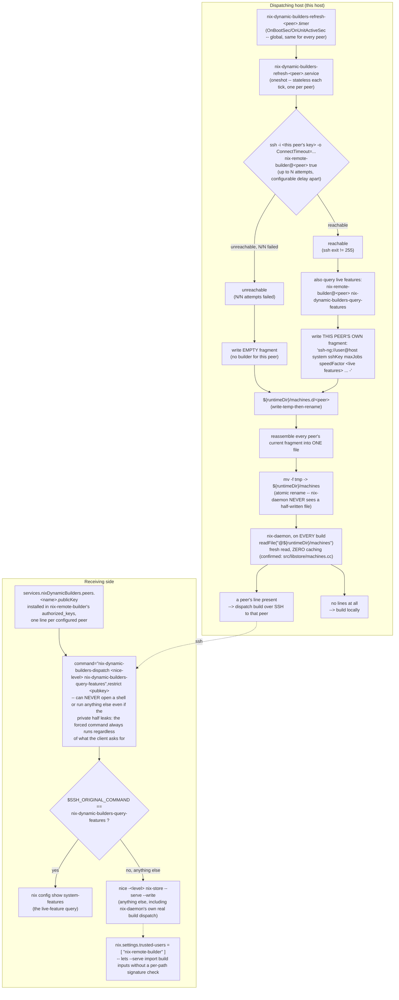

# nixos-remote-builder-liveness-module

A NixOS module that gives `nix.settings.builders` a live, self-updating
peer instead of a static one. A systemd timer probes a peer machine's
SSH reachability every 60 seconds and atomically rewrites a plain
runtime file that `nix-daemon` re-reads fresh on every single build
dispatch. The peer being up or down takes effect on the very next
build -- no `nixos-rebuild switch`, no daemon restart, on either side.

Built for a small personal fleet of two (or more) machines where the
"remote builder" isn't a dedicated, always-on build box but something
like a second laptop that's only sometimes switched on. A build
dispatched to a sleeping peer under a static `nix.buildMachines`
config just hangs or fails; this module falls back to building locally
instead, silently and automatically.

## How it works

Every configured peer gets its own independent timer/service pair, so a
host with several peers probes each on its own schedule:



See [`docs/decisions/0001`](docs/decisions/0001-live-file-over-static-buildmachines.md)
for why a live `@file` was chosen over the built-in static
`nix.buildMachines`,
[`docs/decisions/0002`](docs/decisions/0002-tofu-host-key-checking.md)
for the host-key-checking and trust-model rationale,
[`docs/decisions/0003`](docs/decisions/0003-multi-peer-and-key-model.md)
for the multi-peer/per-host-identity-key design and why `supportedFeatures`
is live while `mandatoryFeatures` stays static, and
[`docs/decisions/0004`](docs/decisions/0004-nspawn-test-backend.md) for
why the test suite runs on `systemd-nspawn` rather than QEMU.

## Setup

Each host gets its own identity key -- never the same private key copied
onto two hosts. `sshKey` has no default -- every install must pick one
of three meanings explicitly: `true` generates a key for you on the
first probe tick (no `ssh-keygen` or secrets manager required), a
path/string points at a key you manage yourself, and `false` requires
every peer to set its own key explicitly.

Since the key is generated at runtime, its public half isn't known at
eval time -- wiring up a peer relationship is a two-step bootstrap:

1. On **each** host, import this module and enable it with the peer's
   `publicKey` left as a placeholder for now (any string; it'll be
   replaced in step 3):

   ```nix
   {
     inputs.nix-dynamic-builders.url = "github:dvaerum/nixos-remote-builder-liveness-module";
     # ...
   }
   ```

   ```nix
   # host A's configuration
   services.nixDynamicBuilders = {
     enable = true;
     sshKey = true; # generate on first use, no ssh-keygen/secrets manager needed
     peers.host-b = {
       maxJobs = 8; # size below host B's real thread count if it's a
                    # dual-use machine someone also works on directly
       publicKey = "placeholder -- replaced in step 3";
     };
   };
   ```

2. Deploy both hosts. Each starts generating its own key and probing the
   other (which will fail until step 3 -- that's expected).

3. On each host, run `nix-dynamic-builders-show-key host-b` (substituting
   whichever peer name you used) to print that key's public half, and
   paste it into the *other* host's `publicKey` -- i.e. host A's real
   key goes into host B's config, and vice versa. Redeploy both.

Once that's done, both hosts quietly probe each other every 60s and the
chicken-and-egg bootstrap step is never needed again, even if a key is
later regenerated -- just repeat step 3 for whichever side changed.

If you'd rather skip the bootstrap step, generate a keypair yourself
(`ssh-keygen -t ed25519 -N "" -f nix-dynamic-builders_ed25519`) and point
`sshKey` at the private half -- then both sides' `publicKey` are known
upfront and a single deploy is enough. Hand `sshKey` the **decrypted
secret path** from a secrets manager like
[sops-nix](https://github.com/Mic92/sops-nix) or
[agenix](https://github.com/ryantm/agenix) (a plain string, e.g.
`config.sops.secrets."nix-dynamic-builders-key".path`), not a bare Nix
path literal (`./nix-dynamic-builders_ed25519`) -- a path literal gets
copied into the world-readable Nix store, and separately breaks
`nix-dynamic-builders-show-key --default`'s `.pub`-sibling lookup (see
`docs/decisions/0003`'s "known limitation"). The public half isn't
secret, so it's fine to just paste its content directly:

```nix
# host A's configuration -- private key decrypted by sops-nix at
# activation (never touches the Nix store); public key pasted directly
# since it isn't secret.
services.nixDynamicBuilders = {
  enable = true;
  sshKey = config.sops.secrets."nix-dynamic-builders-key".path;
  peers.host-b = {
    maxJobs = 8;
    publicKey = "ssh-ed25519 AAAA...host-b's-real-public-key";
  };
};
```

A host can list more than one peer under `peers`, each keyed by its own
name (which also becomes its hostname by default -- set `hostname`
explicitly only if the peer's reachable name differs from the name you
give it here).

## Options reference

See [`docs/options.md`](docs/options.md) (generated via `generate-doc.nix`)
for the full option reference, or `nixosModule/options.nix` directly.
See [`examples/`](examples/) for a working, tested set of scenarios
(a single peer, two independent peers, a pre-existing keypair instead
of self-generation, and tuning the probe itself) -- each one is
exercised by `tests/nixos/examples.nix`, so a renamed/removed option
breaks CI, not just the docs.

`nix-dynamic-builders-show-key <peer-name>|--default|--fzf` prints a
public key (not secret) for pasting into the other host's `publicKey` --
see Setup above. Run with no arguments for a list of known names.

## Trust model

Read [`docs/decisions/0002`](docs/decisions/0002-tofu-host-key-checking.md)'s
"Trust model, stated plainly" section before pointing this at anything
you wouldn't otherwise trust with `sudo`-equivalent access. This is
built for a small fleet under one administration, not for untrusted or
third-party peers.

## Testing

```bash
nix flake check -L
```

Runs two real multi-host tests, both on `systemd-nspawn` containers --
see `docs/decisions/0004`:

- `tests/nixos/liveness.nix`: three real peers probe each other over
  real SSH, the assembled machines file picks up each live peer
  independently (proving fragment-per-peer writes don't clobber each
  other), falls back to empty for just the one direction that drops,
  live-fetches a peer's real `system-features`, and exercises
  self-generated keys, `show-key`, and the public-key-readability toggle.
- `tests/nixos/examples.nix`: every file under `examples/` actually
  evaluates and wires up the units it claims to.

## Development

```
nix flake check -L                                        # the whole test suite
nix fmt                                                     # format all .nix files
nix-build generate-doc.nix && cp result docs/options.md     # regenerate the option reference
```

See `AGENTS.md` for the full contributor/agent workflow, including the
versioning policy.
